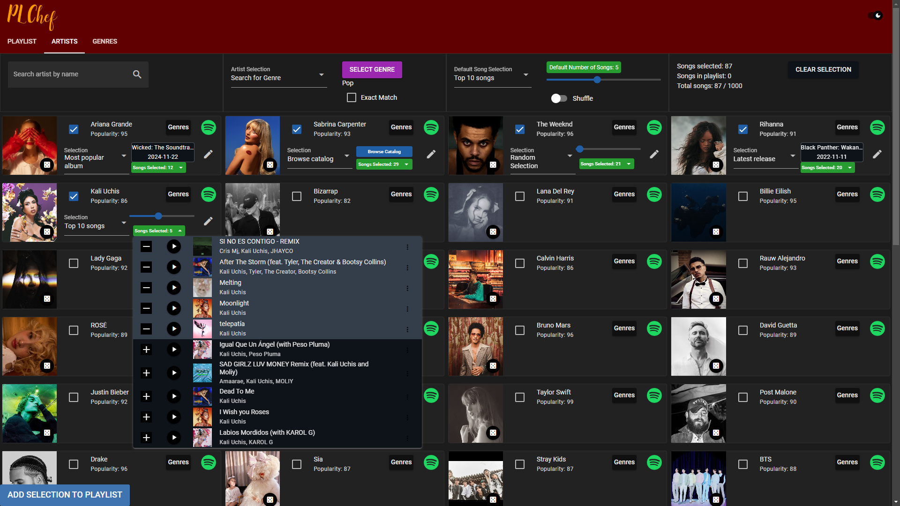
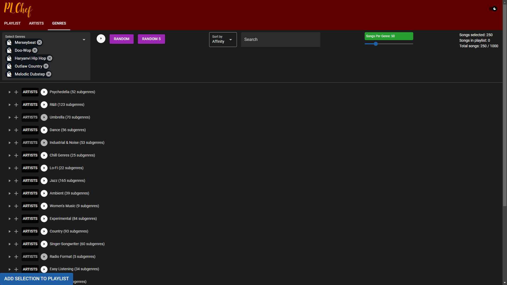
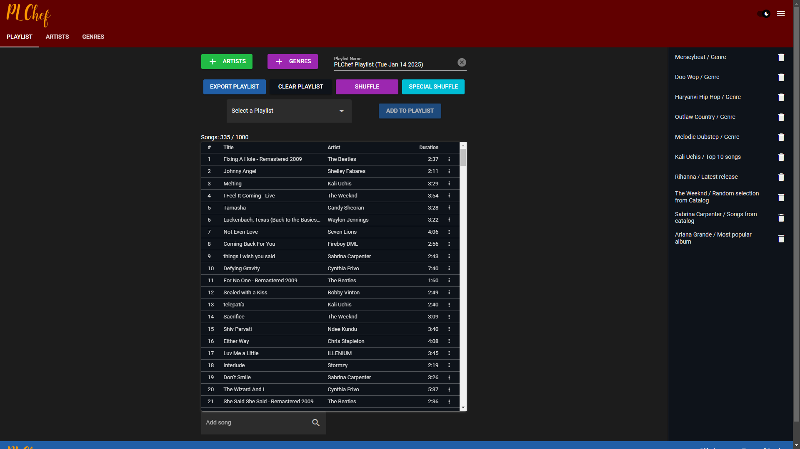

# PLChef

A Vue webapp for exploring the Spotify catalogue and making playlists quickly. Built with Quasar Framework.

## Screenshots





## Install the dependencies
```bash
npm install
```

### Start the app in development mode (hot-code reloading, error reporting, etc.)
Make the env file from example.
```bash
npm run dev
```

### Build the app for production (better performance, all genres)
Make the env.production file from example.
```bash
npm i -g @quasar/cli #installing the quasar cli
quasar build
quasar serve --history dist/spa
```

See Quasar Docs for more build information.

### Customize the configuration
See [Configuring quasar.config.js](https://v2.quasar.dev/quasar-cli-vite/quasar-config-js).
